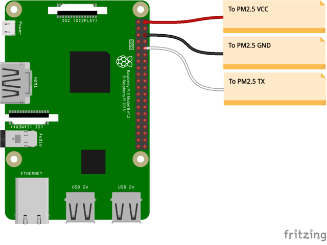

## Raspberry Pi Sensor Code ##

Personal Python scripts for running sensors on Raspberry Pi. Currently focused on air quality from Plantower PMS5003 sensor, using Adafruit code.

### Plantower PMS5003

#### Hardware ####

This sensor is currently attached to a Raspberry Pi Model 4 B+ with 4 GB of RAM. The sensor is connected via serial cable to breakout board from Adafruit, which is then attached via jumper wires to the GPIO pins on the Raspberry Pi. Wiring details and the second image below can be found at https://learn.adafruit.com/pm25-air-quality-sensor/python-and-circuitpython.

#### Software ####

I'm using Adafruit's CircuitPython PM25 module to read data from the sensor: https://github.com/adafruit/Adafruit_CircuitPython_PM25. Using this code requires installing both Adafruit's Blinka module to use their CircuitPython code (https://pypi.org/project/Adafruit-Blinka/), as well as pyserial (https://pypi.org/project/pyserial/). The blinkatest.py and pm25_simpletest.py scripts included here are both scripts from Adafruit for testing these modules.

The pm25_simpletest.py module required one significant tweak from the settings described at https://learn.adafruit.com/pm25-air-quality-sensor/python-and-circuitpython. The timeout parameter for reading from the UART interface in the script was set to 0.25, which was too fast for the sensor to transmit data, causing it to fail repeatedly, so I changed it to 1:

`uart = serial.Serial("/dev/ttyS0", baudrate=9600, timeout=1)`

The two log scripts are custom scripts to take data at an interval and write the output to a csv file using pandas. Currently, the main script outputs data every 10 minutes and is designed to stop once the date changes.

#### Next Steps ####

* Configure scripts to run and collect data automatically, then store it locally on an NAS drive.
* Get interface for plotting data in real time and publish that to separate repository on GitHub pages.

