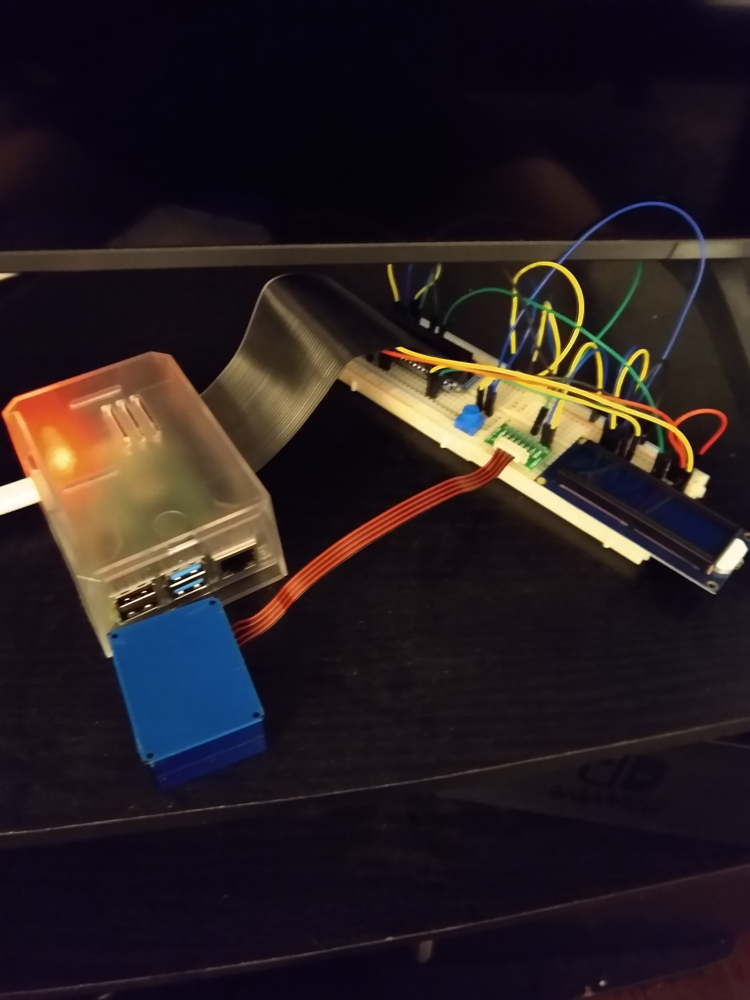

## Raspberry Pi Sensor Code ##

Personal Python scripts for running sensors on Raspberry Pi. Currently focused on air quality from Plantower PMS5003 sensor, using Adafruit code.

### Plantower PMS5003

#### Hardware ####

This sensor is currently attached to a Raspberry Pi Model 4 B+ with 4 GB of RAM. The sensor is connected via serial cable to breakout board from Adafruit, which is then attached via jumper wires to the GPIO pins on the Raspberry Pi. Wiring details and the second image below can be found at https://learn.adafruit.com/pm25-air-quality-sensor/python-and-circuitpython.

#### Software ####

I'm using Adafruit's CircuitPython PM25 module to read data from the sensor: https://github.com/adafruit/Adafruit_CircuitPython_PM25. Using this code requires installing both Adafruit's Blinka module to use their CircuitPython code (https://pypi.org/project/Adafruit-Blinka/), as well as pyserial (https://pypi.org/project/pyserial/). The blinkatest.py and pm25_simpletest.py scripts included here are both scripts from Adafruit for testing these modules.

The pm25_simpletest.py module required one significant tweak from the settings described at https://learn.adafruit.com/pm25-air-quality-sensor/python-and-circuitpython. The timeout parameter for reading from the UART interface in the script was set to 0.25, which was too fast for the sensor to transmit data, causing it to fail repeatedly, so I changed it to 1:

`uart = serial.Serial("/dev/ttyS0", baudrate=9600, timeout=1)`

Even this fails every ~5-8 measurements, so I've now increased it to 2 in the main log script.

The main pm25_log.py script takes data at an interval and writes the output to a csv file using pandas. The nowcast.py file uses functions in processing.py to take the last 12 hours of PM 2.5 data to nowcast an air quality index (AQI), following EPA practices (https://usepa.servicenowservices.com/airnow?id=kb_article&sysparm_article=KB0011856). Currently, these two scripts are run every 10 minutes using a shell script and cron. The data is saved on an NFS share to an NAS drive, and the PM 2.5 data and AQI are uploaded to Adafruit IO.

#### Next Steps ####

* Add RGB LED and LCD screen to output current PM 2.5 and AQI and show the color of the current AQI level.

